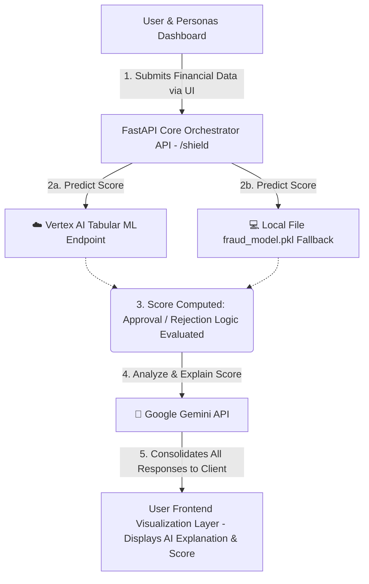

# Digital Shield - Project Documentation

## 1. Introduction
Welcome to **Digital Shield**, an intelligent, AI-powered transaction protection system and fraud detection engine. Digital Shield is designed to monitor financial transactions in real-time, compute a fraud probability score, automatically approve or reject transactions based on risk levels, and dynamically generate human-readable security explanations leveraging large language models. The platform simulates various real-world scenarios through the use of "personas" that act as different types of users making transactions.

## 2. Tech Stack Setup
The application combines a modern backend with a fast frontend interface:

**Frontend Ecosystem:**
- **HTML5:** Structures the transaction dashboard.
- **CSS3:** Built with modern user interface features like glassmorphism and responsiveness.
- **Vanilla JavaScript:** Client-side application logic for dynamically switching scenarios (personas) and exchanging data with our backend.

**Backend & Machine Learning Ecosystem:**
- **Python / FastAPI:** High-performance web framework acting as the core orchestration backend.
- **Google Cloud Vertex AI:** Primary machine learning engine. Evaluates structured/tabular machine learning data securely.
- **Local Machine Learning Models (Scikit-learn / XGBoost):** Loaded via `joblib` from a local file (`fraud_model.pkl`) serving as an active fallback mechanism if the remote instance is down.
- **Google Generative AI (Gemini 2.5 Flash-Lite):** Generative AI API responsible for interpreting fraud models into concise, user-friendly security tips and risk analysis text.
- **Pydantic:** Validating JSON payload payloads gracefully.

## 3. Comprehensive Architecture Overview
The system architecture revolves around an asynchronous execution path divided into robust prediction and intuitive explanation loops. 

### Step-by-Step Flow:
1. **User Interaction (Frontend)**: The user visits the web app and interacts with various dynamically populated "Personas". Selecting a persona updates the features array.
2. **Analysis Trigger:** The user triggers the `/shield` POST API endpoint on the FastAPI backend server with the relevant transaction features (Amount, Merchant Category, Location Mismatches, IP Risk, Device Trust, etc.).
3. **Primary Inference (Prediction Strategy)**:
    - *Plan A:* The backend forwards the numeric model features to the Google Cloud Vertex AI standard remote endpoint. 
    - *Plan B (Fallback):* If the Vertex AI service connection fails, the FastAPI server computes identical data features against the native Python `fraud_model.pkl` local file.
4. **Scoring Logic**: A unified probability evaluation returns a scaled `fraud_score`. Transactions scoring `0.3` or greater are officially marked **Rejected**; otherwise, they are marked **Approved**.
5. **Generative Security Guidance (Gemini Integration)**:
    - The transaction parameters, alongside the generated `fraud_score` and `risk_level` (High, Medium, Low), are formatted securely into a prompt.
    - This prompt is processed by the **Gemini 2.5 Flash-Lite** foundation model. It assumes the persona of "Digital Shield AI" and concisely maps out an explanation and user guidance for the fraud scenario.
6. **Result Handling:** A consolidated JSON response containing the prediction outcome, source (local or vertex), risk percent, transaction status, and AI explanation is routed back to the client UI.

## 4. Architecture Graph (NotebookLM / Mermaid Compatible)
This architectural model overview can be explicitly mapped using nodes:



## 5. Development Details
Make sure to copy the `.env.example` to `.env` file and fill in your Gemini API key. 
To start the FastAPI web server from the project directory:
```bash
python -m uvicorn main:app --reload --port 8000
```
Then visit [`http://localhost:8000`](http://localhost:8000).
